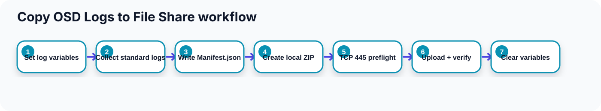

# Design

    <picture>
        <source media="(max-width: 960px)" srcset="../assets/copylog-flow-compact.svg">
        
    </picture>

[View the full-size collection workflow](../assets/copylog-flow.svg).

Set log variables, collect standard logs, write `Manifest.json`, create a local ZIP, check TCP 445, then upload and verify remote byte size. Native Task Sequence steps clear credentials on success and failure. Extended logs remain opt-in.

This utility uses these principles:

- Keep the operational script focused on one task.
- Keep examples generalized.
- Avoid organization-specific values in public content.
- Use readable Windows PowerShell 5.1 code.
- Log to `_SMSTSLogPath` when available and `%WINDIR%\Temp` otherwise.
- Use native Task Sequence steps to create and clear credential variables.
- Treat generated logs and archives as internal diagnostic data.

The sequence is collection, `Manifest.json`, local ZIP creation, TCP 445 preflight, authenticated SMB upload, remote-size verification, then successful local cleanup.
Size verification detects incomplete copies; it is not a remote content hash.
Failed uploads retain the local archive. Archive names include a timestamp and GUID to avoid overwriting previous attempts.
In WinPE, a valid `OSDisk` identifies the offline Windows and ProgramData roots; it accepts a drive with or without a trailing backslash.
The standard collection profile remains focused; `-IncludeExtendedLogs` adds setup, servicing, update, and rollback locations.
When a source contains the staging directory, collection skips the direct child containing staging and logs a warning to prevent recursive self-collection.
